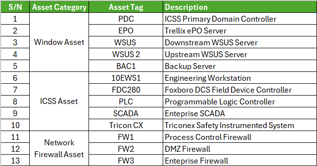

## Detailed Explanation – Risk Assessment and Network Architecture

This Process is guided by the following standard:
1. **ISA/IEC 62443-3-2** – *Security Risk Assessment for System Design*

The risk assessment follows a structured process consisting of the following steps:
1.  Identification of the System under Consideration (SuC)
2.  Partition the SuC into zones and conduits
3.  Risk Analysis
4.  Risk Evaluation
5.  Risk Treatment

### 1: Identification SuC
The OT Cybersecurity & Process Automation Lab simulates a real-world Industrial Control System (ICS) environment designed to evaluate and test cybersecurity controls and process automation functions in a controlled setting.
The system integrates both cybersecurity management and process control components to reflect an operational technology (OT) environment. It includes:
1.  Primary Domain Controller: *Centralized identity and access management for user authentication and policy enforcement.*
2.  Trellix ePO & ENS: *Endpoint protection and centralized security management.*
3.  Veritas Backup & Recovery System: *Data protection and restoration of critical OT servers.*
4.  Windows Server Update Services (WSUS): *Patch management for controlled updates within the OT domain.*
5.  Enteprise SCADA: *Supervisory Control and Data Acquisition.*
6.  Foxboro Distributed Control System (DCS): *Process Control System.*
7.  Triconex Safety Instrumented System (SIS): *Safety-critical automation ensuring process integrity.*
8.  Programmable Logic Controllers (PLCs): *Localized field control and signal acquisition.*

### Step 2: Threat Identification
Provide screenshots of Excel tables or diagrams.

### Step 3: Risk Evaluation
Describe how you calculated risks, color code meanings, etc.

### Step 4: Mitigation
Show how you linked mitigation steps to later labs (like Endpoint Protection or WSUS).
